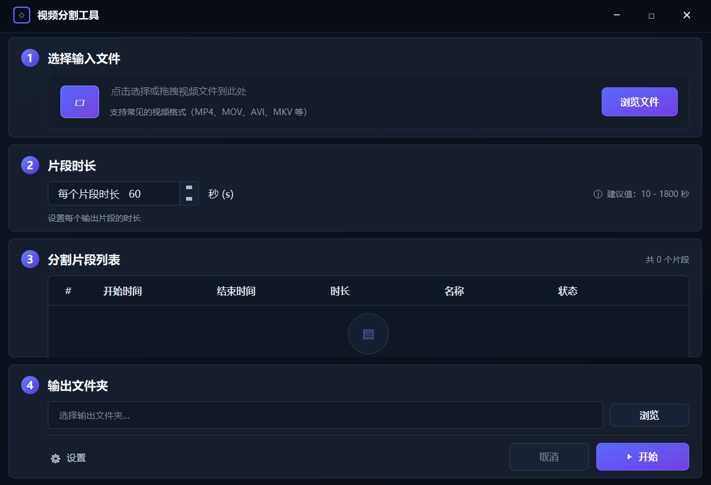

# videoSpliter

基于 Qt5 + FFmpeg 的视频分割工具，支持按时间段批量切割视频。

## 界面预览

### 夜间主题



### 白天主题


## 功能

- 拖拽或选择视频文件自动加载片段列表
- 可视化编辑每个片段的开始/结束时间
- 批量调用 FFmpeg 进行无损分割
- 分割完成后自动打开输出目录
- 无边框窗口，支持拖拽移动、双击最大化

## 依赖

- Qt 5.x（Widgets）
- CMake 3.16+
- Visual Studio 2022（MSVC）
- FFmpeg（已内置于 `3rd/ffmpeg.exe`）

## 构建

```bash
cmake -B build -S .
cmake --build build --config Release
```

输出文件位于 `dist/videoSpliter.exe`。

## 使用

1. 拖拽视频文件到窗口，或点击"选择文件"
2. 在片段列表中设置各段的时间范围
3. 选择输出文件夹
4. 点击"开始分割"
